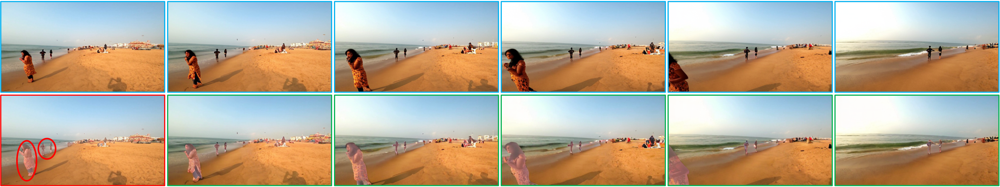

<h1 align="center">Video-GPT via Next Clip Diffusion</h1>


<p align="center">
    <a href="https://vectorspacelab.github.io/OmniGen/">
        
    </a>
    <a href="https://arxiv.org/abs/2409.11340">
            
    </a>
    <a href="https://huggingface.co/GrayShine/Video-GPT">
        
    </a>    
</p>

<h4 align="center">
    <p>
        <a href=#1-news>News</a> |
        <a href=#2-overview>News</a> |
        <a href=#3-methodology>Methodology</a> |
        <a href=#4-what-can-video-gpt-do>Capabilities</a> |
        <a href=#5-quick-start>Quick Start</a> |
        <a href="#6-training">Finetune</a> |
        <a href="#license">License</a> |
        <a href="#citation">Citation</a>
    <p>
</h4>


## 1. News
- 2025-5-16:✨✨We release our 4 stages prograssive training code (supporting Huawei's NPU and NVIDIA's GPU). You can refer to [LVM/script/train](LVM/script/train) and [LVM/train](LVM/train) for detailed training information.
- 2025-5-16:✨✨We release the inference code in [LVM/script/inference](LVM/script/inference) and [LVM/inference](LVM/inference).
- 2025-5-16:🔥🔥We release the first version of Video-GPT. Model Weight: [Video-GPT](https://huggingface.co/GrayShine/Video-GPT)


## 2. Overview

Video-GPT is a video self-supervised generative pre-trained model which treats video as new language for visual world modeling by next clip diffusion. It is designed to be simple, flexible, and easy to follow. We provide [inference code](#5-quick-start) so that everyone can explore more functionalities of Video-GPT.

Previous works on visual generation relies heavily on supervisory signals from textual modalities (such as Sora, WanX, HunyuanVideo, MovieGen). However, vision, as a natural ability of human beings, was formed even earlier than language. Therefore, we believe that the information of the visual modality itself is sufficient to support the model to model the world.


In addition, compared with the previous model architecture with many special designs for diffusion model (e.g., UNet, DiT, MM-DiT), we adopted the simplest vanilla transformer architecture. On the one hand, it is more conducive to the exploration of scaling law in the future. On the other hand, it is also more convenient for the community to follow up.

Due to the limited resources, Video-GPT still has room for improvement. We will continue to optimize it, and hope it inspires more universal video generative foundation models. 

If you have any questions, ideas, or interesting tasks you want Video-GPT to accomplish, feel free to discuss with us: hahahahaha@sjtu.edu.cn. We welcome any feedback to help us improve the model.


## 3. Methodology

You can see details in our [paper](https://arxiv.org/abs/2409.11340). 


## 4. What Can Video-GPT do?

Video-GPT is a video self-supervised generative pre-trained model that you can use to perform various tasks. It can be directly applied to video prediction, or fine-tuned to tasks such as video object segmentation and image animation with very little data. Its intermediate layer features are also suitable for representation learning. 

Here is the illustrations of Video-GPT's capabilities: 
- Powerful world modeling capabilities

- Based on the pre-trained Video-GPT, we continue training on class to video and text to video tasks, and can achieve better results than training from scratch.


- By fine-tuning with a small amount of data, Video-GPT can also achieve good generalization performance on downstream tasks.




## 5. Quick Start


### Using Video-GPT
Install via Github:
```bash
git clone https://github.com/zhuangshaobin/Video-GPT.git
cd Video-GPT
```
If you are using GPUs from NVIDIA, then
```bash
bash env_nv.sh
```
If you are using NPUs from Huawei, then
```bash
bash env_hw.sh
```


Then you can use the following command to extract the first few frames of the video for video prediction.
If you are using GPUs from NVIDIA, then
```bash
bash LVM/script/inference/inference_nv.sh
```
If you are using NPUs from Huawei, then
```bash
bash LVM/script/inference/inference_hw.sh
```


## 6. Training
We provide our 4 stage training script to train or fine-tune Video-GPT. 
If you are using GPUs from NVIDIA, then
```bash
# 1-stage pre-training
bash LVM/script/train/pretrain_stage1_nv.sh
# 2-stage pre-training
bash LVM/script/train/pretrain_stage2_nv.sh
# 3-stage pre-training
bash LVM/script/train/pretrain_stage3_nv.sh
# 4-stage pre-training
bash LVM/script/train/pretrain_stage4_nv.sh
```

If you are using NPUs from Huawei, then
```bash
# 1-stage pre-training
bash LVM/script/train/pretrain_stage1_hw.sh
# 2-stage pre-training
bash LVM/script/train/pretrain_stage2_hw.sh
# 3-stage pre-training
bash LVM/script/train/pretrain_stage3_hw.sh
# 4-stage pre-training
bash LVM/script/train/pretrain_stage4_hw.sh
```


### Contributors:
Thank all our contributors for their efforts and warmly welcome new members to join in!

<a href="https://github.com/VectorSpaceLab/OmniGen/graphs/contributors">
  
</a>

## License
This repo is licensed under the [MIT License](LICENSE). 


## Citation
If you find this repository useful, please consider giving a star ⭐ and citation
```
@article{xiao2024omnigen,
  title={Omnigen: Unified image generation},
  author={Xiao, Shitao and Wang, Yueze and Zhou, Junjie and Yuan, Huaying and Xing, Xingrun and Yan, Ruiran and Wang, Shuting and Huang, Tiejun and Liu, Zheng},
  journal={arXiv preprint arXiv:2409.11340},
  year={2024}
}
```


